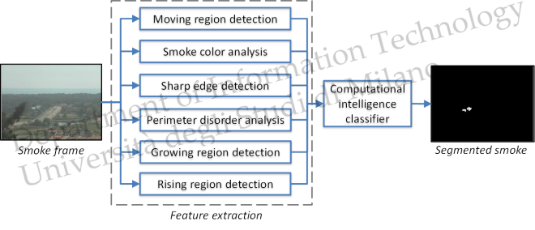

<div align="center">

# 🔥🌫️ Wildfire Smoke Detection

### Computational intelligence techniques for early wildfire smoke detection in video sequences

[](https://www.mathworks.com/products/matlab.html)
[](LICENSE)
[](https://ieeexplore.ieee.org/document/6059930)
[](https://ieeexplore.ieee.org/document/6425498)
[](https://homes.di.unimi.it/genovese/wild/wildfire.htm)

**MATLAB source code for wildfire smoke detection using motion, appearance, and computational intelligence techniques.**

</div>

---

## 🧠 Overview

**WildfireSmokeDetection** provides MATLAB code for detecting wildfire smoke in video sequences.  
The repository accompanies the research works:

- **Wildfire smoke detection using computational intelligence techniques**, CIMSA 2011
- **Wildfire smoke detection using computational intelligence techniques enhanced with synthetic smoke plume generation**, IEEE TSMC:S 2013

The system is designed for early smoke detection from visual video streams, combining image processing and computational intelligence techniques to distinguish smoke-like regions from non-smoke background activity.

---

## ✨ Key Features

- 🎥 Video-based wildfire smoke detection workflow
- 🌫️ Candidate smoke region analysis
- 🧩 Feature extraction modules for visual smoke characterization
- 🤖 Computational-intelligence-based classification pipeline
- 🧪 Example smoke video directory included in the expected project layout
- 📊 Reproducible MATLAB scripts connected to published research papers

---

## 🧭 Processing Pipeline




The workflow starts from video frames, extracts candidate regions and descriptors, and then applies classification methods to identify smoke-related patterns.

---

## 📁 Repository Structure

```text
WildfireSmokeDetection/
│
├── launch_smokeClassification.m     # Main script for smoke classification
├── Bb_params.m                      # Parameter/configuration file
├── README.md                        # Project documentation
├── LICENSE                          # GPL-3.0 license
│
├── (VID SEGM) Smoke3/               # Example video directory
├── Feature_extraction/              # Feature extraction routines
└── util/                            # Utility functions
```

---

## 🚀 Getting Started

### 1. Clone the repository

```bash
git clone https://github.com/AngeloUNIMI/WildfireSmokeDetection.git
cd WildfireSmokeDetection
```

### 2. Check the input videos

The original repository expects an example video directory at:

```text
./(VID SEGM) Smoke3/
```

Place the video sequences or segmented video material required by the scripts in this directory.

### 3. Configure parameters

Open and review:

```text
Bb_params.m
```

This file contains the main configuration parameters used by the smoke classification workflow.

### 4. Run the main script

From MATLAB, run:

```matlab
launch_smokeClassification
```

---

## 📊 Expected Output

Depending on the selected configuration and input videos, the code can be used to produce:

| Output | Description |
|---|---|
| Candidate regions | Regions selected as possible smoke areas |
| Extracted descriptors | Visual features computed from candidate regions |
| Classification results | Smoke / non-smoke decisions |
| Experimental data | Intermediate MATLAB variables and evaluation outputs |

---

## 🧪 Example Videos and Project Page

The project page provides additional material and example videos:

```text
https://homes.di.unimi.it/genovese/wild/wildfire.htm
```

---

## 🔗 Related Work

This repository is related to the companion synthetic smoke generation code:

```text
https://github.com/AngeloUNIMI/SmokeSimulation
```

The code also implements some algorithms described in the VisiFire project:

```text
http://signal.ee.bilkent.edu.tr/VisiFire/
```

---

## 📚 Papers

### CIMSA 2011

A. Genovese, R. Donida Labati, V. Piuri, and F. Scotti,  
**“Wildfire smoke detection using computational intelligence techniques,”**  
IEEE International Conference on Computational Intelligence for Measurement Systems and Applications,  
Ottawa, Canada, September 2011, pp. 1–6.  
DOI: `10.1109/CIMSA.2011.6059930`

### IEEE TSMC:S 2013

R. Donida Labati, A. Genovese, V. Piuri, and F. Scotti,  
**“Wildfire smoke detection using computational intelligence techniques enhanced with synthetic smoke plume generation,”**  
IEEE Transactions on Systems, Man, and Cybernetics: Systems,  
vol. 43, no. 4, July 2013, pp. 1003–1012.  
DOI: `10.1109/TSMCA.2012.2224335`

---

## ✍️ Citation

If you use this code, please cite the related publications:

```bibtex
@InProceedings{CIMSA2011,
  author    = {A. Genovese and R. {Donida Labati} and V. Piuri and F. Scotti},
  booktitle = {Proc. of the 2011 IEEE Int. Conf. on Computational Intelligence for Measurement Systems and Applications},
  title     = {Wildfire smoke detection using computational intelligence techniques},
  address   = {Ottawa, ON, Canada},
  pages     = {1--6},
  month     = {September},
  day       = {19--21},
  year      = {2011},
  note      = {978-1-61284-924-9}
}
```

```bibtex
@Article{tsmca12,
  author  = {R. {Donida Labati} and A. Genovese and V. Piuri and F. Scotti},
  title   = {Wildfire smoke detection using computational intelligence techniques enhanced with synthetic smoke plume generation},
  journal = {IEEE Transactions on Systems, Man, and Cybernetics: Systems},
  volume  = {43},
  number  = {4},
  pages   = {1003--1012},
  month   = {July},
  year    = {2013},
  note    = {2168-2216}
}
```

---

## 👥 Authors

- **Angelo Genovese**
- **Ruggero Donida Labati**
- **Vincenzo Piuri**
- **Fabio Scotti**

Department of Computer Science  
Università degli Studi di Milano, Italy

---

## 📄 License

This project is released under the **GNU General Public License v3.0**.  
See the [LICENSE](LICENSE) file for details.
